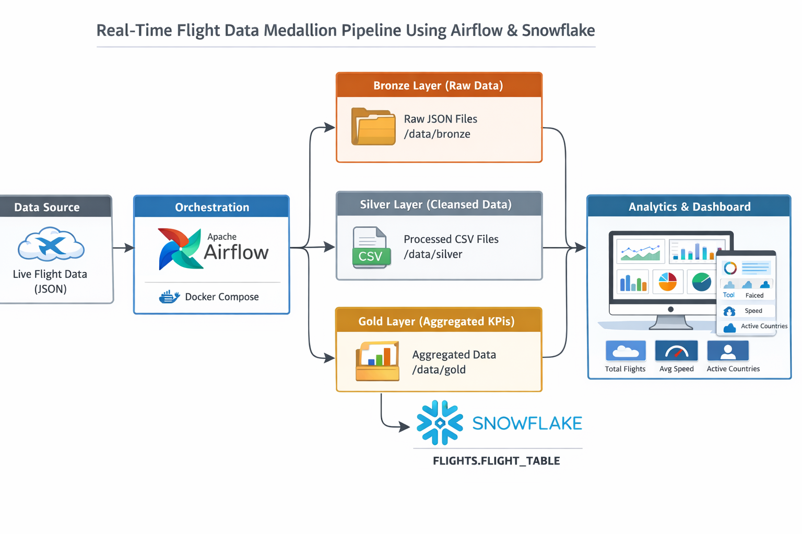

# ✈️ Real-Time Flight Data Medallion Pipeline

A near-real-time data engineering pipeline that ingests live global flight data, processes it through a Bronze → Silver → Gold medallion architecture, and loads aggregated KPIs into Snowflake for analytics.

---

## 🏗️ Architecture

```
OpenSky API → Apache Airflow → Bronze (JSON) → Silver (CSV) → Gold (Aggregated CSV) → Snowflake → Dashboard
```



---

## ⚙️ Tech Stack

| Layer | Tool |
|---|---|
| Orchestration | Apache Airflow |
| Containerization | Docker & Docker Compose |
| Data Processing | Python, Pandas |
| Data Warehouse | Snowflake |
| Data Source | OpenSky Network REST API |
| Language | Python 3 |

---

## 📂 Project Structure

```
├── dags/
│   └── flight-pipeline.py        # Airflow DAG definition
├── scripts/
│   ├── bronze_layer.py           # Raw API ingestion → JSON
│   ├── silver_layer.py           # Cleansing & column selection → CSV
│   ├── gold_layer.py             # Aggregation by country → CSV
│   └── snowflake_implement.py    # MERGE load into Snowflake
├── data/
│   ├── bronze/                   # Raw JSON files
│   ├── silver/                   # Cleaned CSV files
│   └── gold/                     # Aggregated CSV files
├── Architecture.png
└── README.md
```

---

## 🔄 Pipeline Overview

### Bronze Layer
- Calls the [OpenSky Network API](https://opensky-network.org/api/states/all) every 30 minutes
- Saves raw JSON response to `/data/bronze/`

### Silver Layer
- Parses the raw JSON and extracts key fields: `icao24`, `origin_country`, `velocity`, `on_ground`
- Outputs a cleaned CSV to `/data/silver/`

### Gold Layer
- Groups data by `origin_country`
- Computes: `total_flights`, `avg_velocity`, `on_ground` count
- Outputs aggregated CSV to `/data/gold/`

### Snowflake Load
- Connects to Snowflake via Airflow connection (`flight_snowflake`)
- Uses `MERGE` statement to upsert data — no duplicates on re-runs
- Target table: `FLIGHTS.FLIGHTS_SCHEMA.FLIGHT_TABLE`

---

## 🗄️ Snowflake Table Schema

```sql
CREATE TABLE FLIGHT_TABLE (
    window_start    TIMESTAMP,
    origin_country  TEXT,
    total_flights   INT,
    avg_velocity    FLOAT,
    on_ground       INT,
    load_time       TIMESTAMP DEFAULT CURRENT_TIMESTAMP,
    PRIMARY KEY (window_start, origin_country)
);
```

---

## 📊 Dashboard Queries

**Top 5 Countries by Total Flights**
```sql
SELECT origin_country, SUM(total_flights) AS total_flights
FROM FLIGHTS.FLIGHTS_SCHEMA.FLIGHT_TABLE
GROUP BY origin_country
ORDER BY total_flights DESC
LIMIT 5;
```

**Countries with Fastest Average Speed**
```sql
SELECT origin_country, ROUND(AVG(avg_velocity), 2) AS avg_speed
FROM FLIGHTS.FLIGHTS_SCHEMA.FLIGHT_TABLE
GROUP BY origin_country
ORDER BY avg_speed DESC
LIMIT 5;
```

**Flight Activity Trend Over Time**
```sql
SELECT DATE(window_start) AS flight_date, SUM(total_flights) AS total_flights
FROM FLIGHTS.FLIGHTS_SCHEMA.FLIGHT_TABLE
GROUP BY DATE(window_start)
ORDER BY flight_date;
```

---

## 🚀 Getting Started

### Prerequisites
- Docker & Docker Compose
- Snowflake account
- Airflow Snowflake connection configured (`flight_snowflake`)

### Environment Variables

Create a `.env` file in the root directory:

```env
# Postgres (Airflow backend)
POSTGRES_USER=
POSTGRES_PASSWORD=
POSTGRES_DB=

# Airflow Admin
AIRFLOW_ADMIN_USER=
AIRFLOW_ADMIN_FIRSTNAME=
AIRFLOW_ADMIN_LASTNAME=
AIRFLOW_ADMIN_EMAIL=admin@example.com
AIRFLOW_ADMIN_PASSWORD=
```

### Run

```bash
docker-compose up -d
```

Access Airflow UI at `http://localhost:8080`, then enable the `flights_ops_medallion_pipe` DAG.

---

## 📌 Notes

- Pipeline runs every **30 minutes** (`*/30 * * * *`)
- `catchup=False` — no backfilling on startup
- Snowflake `MERGE` ensures idempotent loads; safe to re-run
- OpenSky API is free but may rate-limit unauthenticated requests
